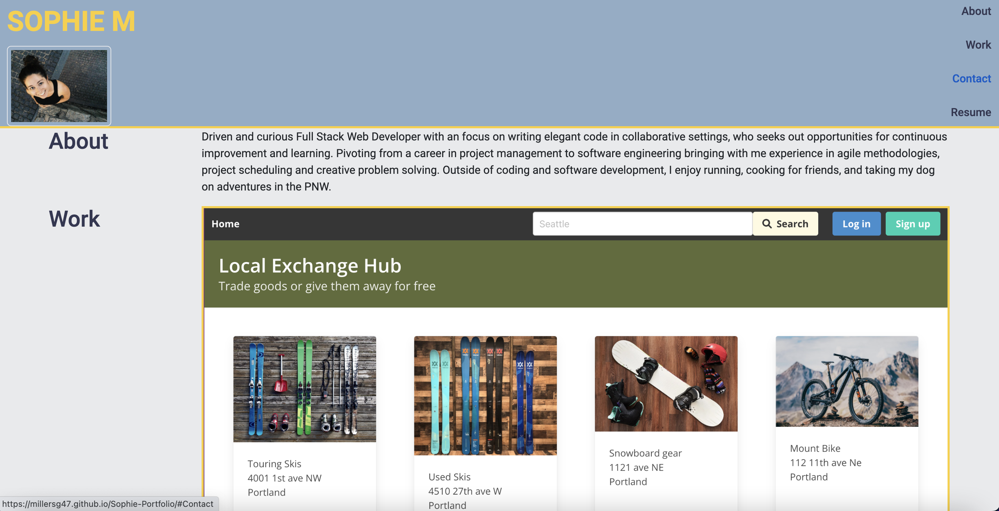

# SOPHIE-PORTFOLIO

## PROJECT OVERVIEW

Sophie's Portfolio is a webpage built to showcase my work as a web developer. It includes navigation, header, body and section elements presenting information about me and my work, as well as ways to get in contact with me.

Access the webpage here: https://millersg47.github.io/Sophie-Portfolio/

## INSTALLATION

Install this application by cloning the repo locally and using a text editor to manipulate code.

## CONFIGURATION

The application has no menu or modifiable settings. There is no configuration required.

## USAGE

Use this application to access Sophie's Portfolio webpage.

## CREDITS

No other contributors are involved in this project at this time.

## END OF README
